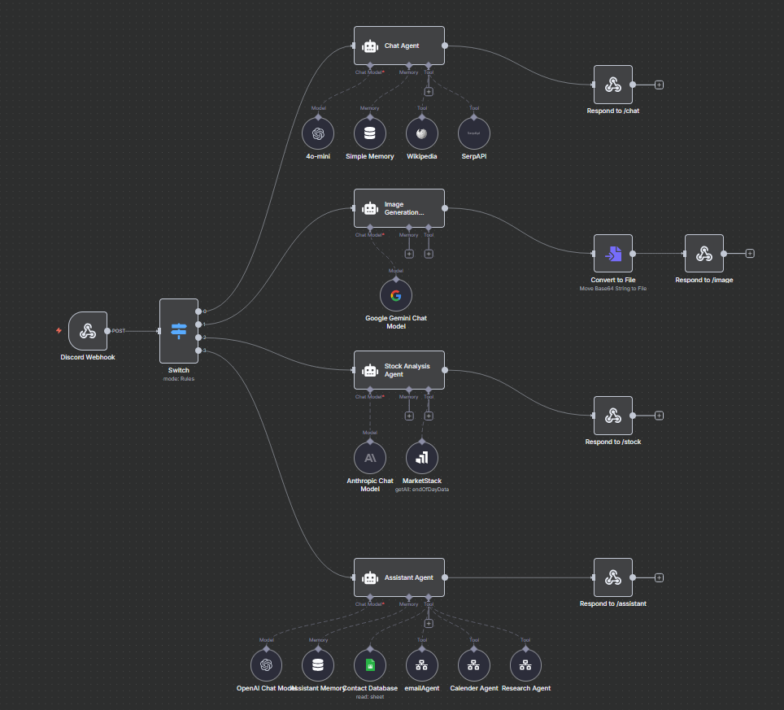

# Aj-Helper: Your Personal AI Assistant on Discord


Aj-Helper is a versatile and intelligent Discord bot designed to be your personal assistant. It leverages the power of AI to provide a wide range of functionalities, from engaging in conversations and generating images to providing stock market information. The bot is built with Python using the `discord.py` library and integrates seamlessly with n8n for powerful workflow automation.

## ✨ Features

Aj-Helper comes packed with a variety of slash commands to enhance your Discord server experience:

- **`/chat`**: Engage in a conversation with the AI. Ask questions, get explanations, or just have a friendly chat.
- **`/image`**: Generate stunning images based on your text prompts. Unleash your creativity!
- **`/stock`**: Get real-time stock information. Simply provide the stock symbol and exchange.
- **`/assistant`**: A private command for the bot owner to interact with a personal AI assistant for more specific tasks.

## 🛠️ Technologies Used

- **[Python](https://www.python.org/)**: The core programming language for the bot.
- **[discord.py](https://discordpy.readthedocs.io/en/latest/)**: A modern, easy-to-use, feature-rich, and async-ready API wrapper for Discord.
- **[n8n](https://n8n.io/)**: A powerful workflow automation tool that powers the bot's backend logic.
- **[Flask](https://flask.palletsprojects.com/en/3.0.x/)**: A lightweight web framework used to keep the bot alive through a web server.
- **[python-dotenv](https://pypi.org/project/python-dotenv/)**: For managing environment variables.

## 🚀 Getting Started

Follow these instructions to get a copy of the project up and running on your local machine for development and testing purposes.

### Prerequisites

Make sure you have the following installed on your system:

- [Python 3.10+](https://www.python.org/downloads/)
- [pip](https://pip.pypa.io/en/stable/installation/) (Python package installer)
- A Discord account and a created bot application.

### Installation

1.  **Clone the repository:**

    ```sh
    git clone https://github.com/arnavkj11/Aj-Helper.git
    cd Aj-Helper
    ```

2.  **Create a virtual environment (recommended):**

    ```sh
    python -m venv .venv
    source .venv/bin/activate  # On Windows, use `.venv\Scripts\activate`
    ```

3.  **Install the dependencies:**

    ```sh
    pip install -r requirements.txt
    ```

4.  **Set up your environment variables:**
    Create a `.env` file in the root of the project and add the following variables:

    ```env
    DISCORD_BOT_TOKEN="YOUR_DISCORD_BOT_TOKEN"
    N8N_WEBHOOK_URL="YOUR_N8N_WEBHOOK_URL"
    OWNER_ID="YOUR_DISCORD_USER_ID"
    ```

### N8N Workflow



### Running the Bot

Once you have completed the installation and setup, you can run the bot with the following command:

```sh
python main.py
```

## Usage

Here's how you can use the bot's commands on your Discord server:

- **/chat `prompt`**:

  - Starts a conversation with the AI.
  - Example: `/chat What is the capital of France?`

- **/image `prompt`**:

  - Generates an image based on the provided text.
  - Example: `/image A cat wearing a superhero cape`

- **/stock `prompt`**:

  - Fetches stock information.
  - Example: `/stock AAPL NASDAQ`

- **/assistant `prompt`**:
  - Sends a private prompt to your personal AI assistant (only usable by the owner).
  - Example: `/assistant Remind me to buy groceries tomorrow.`

## Project Structure

```
.
├── .env                # Environment variables (not version controlled)
├── .gitignore          # Files to be ignored by Git
├── bot.py              # Contains the core Discord bot logic and command handlers
├── config.py           # Manages configuration and environment variables
├── main.py             # The main entry point of the application
├── n8n_client.py       # A client for interacting with the n8n workflows
├── requirements.txt    # A list of Python dependencies for the project
├── web_server.py       # A simple Flask web server to keep the bot alive
└── README.md           # This file
```

## 🤝 Contributing

Contributions are what make the open-source community such an amazing place to learn, inspire, and create. Any contributions you make are **greatly appreciated**.

If you have a suggestion that would make this better, please fork the repo and create a pull request. You can also simply open an issue with the tag "enhancement".

1.  Fork the Project
2.  Create your Feature Branch (`git checkout -b feature/AmazingFeature`)
3.  Commit your Changes (`git commit -m 'Add some AmazingFeature'`)
4.  Push to the Branch (`git push origin feature/AmazingFeature`)
5.  Open a Pull Request

---

Made with ❤️ by Arnav
